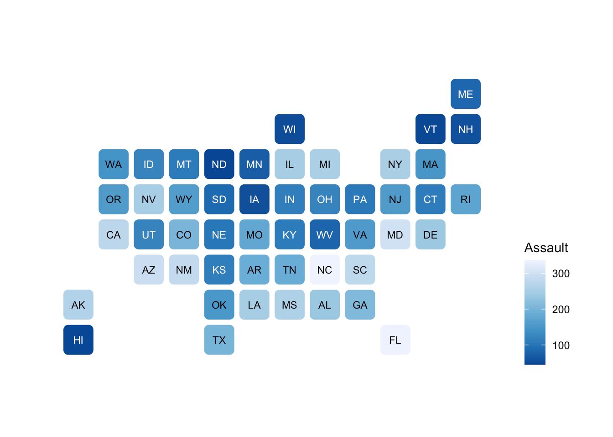

# data-grid-cartograms

A curated collection of grid cartograms, in a machine readable format.

> A grid cartogram is a representation barely similar to a map, that distorts the forms and areas, and assigns to every subdivision one and only one unit of a grid. They are also referred as grid map, mosaic cartogram, pseudo-Demers cartogram, square cartograph maps, geofacets, geogrid, tile grid map, or tile map. For example, the following map represents every state of the United States by exactly one square in a rectangular grid:



## Structure of this collection

The collected grid cartograms are stored in a directory structure that follows the pattern:

```
.
└── <category>
    └── <whole>
        └── <parts>
            └── <name>
                ├── grid.csv
                ├── ids.csv
                └── README.md
```

Where:

- <category> is a broad category of the cartogram, such as "continents" or "countries".
- <whole> is the whole entity that the cartogram represents, such as "us", "africa", or "world".
- <parts> is the parts that the whole is divided into, such as "States", "Countries", or "Seats".
- <name> is the name of the cartogram
- `grid.csv` contains the grid cartogram as ASCII art. A filled cell is represented by an identifier. For readability, all the identifiers should have the same length and an empty cell should be contain the same number of spaces. For countries or states, the identifier can be the ISO 3166-1 alpha-2 or alpha-3 code.
- `ids.csv` contains the mapping between the identifiers in `grid.csv` and the actual names of the parts. The first column contains the identifier, and the second column contains the name. Additional columns can be added for metadata.
- `README.md` contains a description of the cartogram, including the source, date, and any other relevant information.

## Contribute

You want to signal a grid cartogram should be added to the collection? Please open an [issue](https://github.com/severo/data-grid-cartograms/issues/new?template=propose-a-new-grid-cartogram.md) and paste the reference URL. We will then take care of transcribing it to the ASCII-art data format.

You want to add the data for a grid cartogram? Open a [pull request](https://github.com/severo/data-grid-cartograms/pulls) where you add a new directory to the collection. Take care of following the [structure](#structure-of-this-collection) and the formats of `grid.csv` and `ids.csv`. Also, please add a `README.md` file with a description of the cartogram, including the source, date, and any other relevant information. Finally, update the root `index.json` file to include the new cartogram.

Other ideas? Open an issue or a pull request and let's discuss!

## Explore the collection

You can browse all grid cartograms contributed so far in this [observable notebook](https://observablehq.com/@mauforonda/grid-cartogram-collection).

## Read more on grid cartograms

In 2020, I wrote a [review about grid cartograms](https://observablehq.com/@severo/grid-cartograms) on Observable. It contains a good list of grid cartograms for countries, continents and the world, and I discussed the terms and the uses for such a chart.

I also wrote some other notebooks around grid cartograms: utilities to load, convert and display the data, intents to automatically create grid cartograms, and tools to compare the accuracy of grid cartograms. You can check them ut in the [Grid cartograms Observable's collection](https://observablehq.com/collection/@severo/grid-maps).
